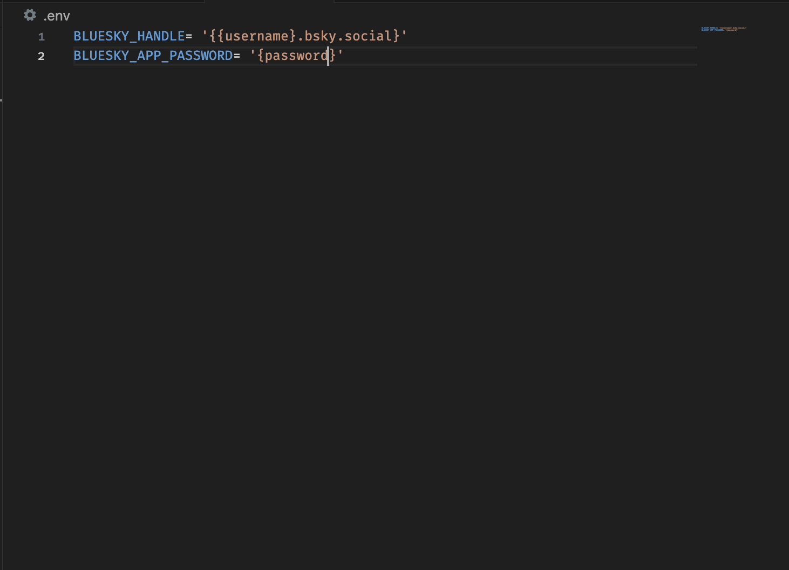
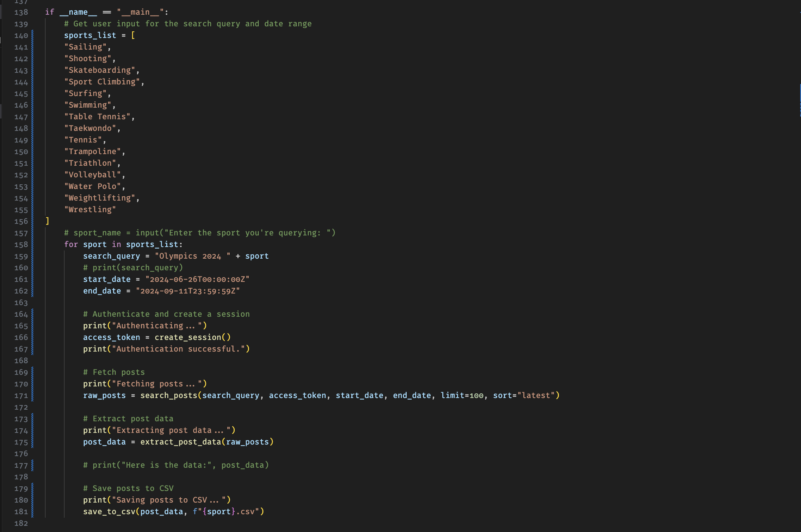
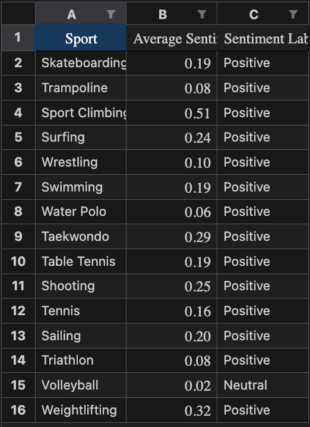

# Data-Mining-Project

# This Repository Has Evolved 🌟

This project has led to the creation of the **MissionBlue API**, an actively developed tool designed for data scraping and analysis of social media posts on the BlueSky platform.

🚀 **Check out the MissionBlue API here:** [MissionBlue API Repository](https://github.com/Lementknight/MissionBlueAPI)  
🔧 **Current Status:** Actively maintained and evolving!

This repository is no longer actively developed, but it remains here for historical reference. For ongoing updates, features, and contributions, please head over to the MissionBlue API repository.

Thank you for your interest and support!

---

Before you can use the BlueSky Webscraper you need to register an account with [Bluesky](https://bsky.app/). Once you create your account you need to create a .env where you have 2 fields BLUESKY_HANDLE and BLUESKY_APP_PASSWORD.

Once you have your creditinals set up run the following commands in your terminal:
```
python3 -m venv .virtualenv
source .virtualenv/bin/activate
pip install -r requirements.txt
```

This will set up the Python virtual environment so that you can run the Bluesky Web Scraper and Sentiment Analysis Script. 

Run this command to conduct the scrape:
```
python3 BlueSkyScraper.py
```

If you want to change any of the parameters of the query before you scrape, you can do that in the main function call.


Once you run the script you should see a directory named DataMiningProcessing. Within this directory will contain csv files that contain the posts corresponding to each sport scraped.

With this directory you can run the sentiment.py file to conduct the sentiment analysis by running this command:
```
python3 sentiment.py
```

The sentiment.py file reads in each csv file from the DataMiningProcessing directory and generates an updated csv that contains the sentiment score for each post. These updated files reside within the Processed directory. Alongside that directory, there will be a file named sports_sentiment_matrix.xlsx which will contain the aggregated sentiment for each sport.

Here is an example of what the file can look like:

